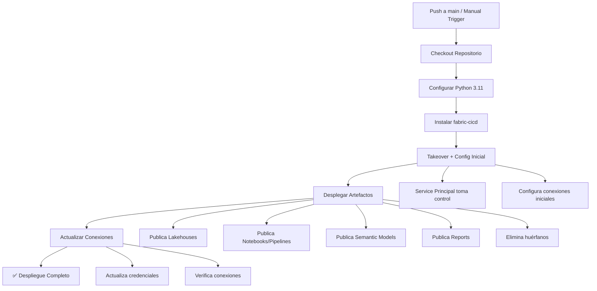

# 🤖 deploy-fabric.yml - Workflow de GitHub Actions

## 📋 Propósito

Este workflow de GitHub Actions **automatiza completamente el despliegue** de artefactos de Microsoft Fabric. Se ejecuta automáticamente en cada push a la rama `main` y puede ser disparado manualmente cuando sea necesario.

## 🏗️ Estructura del Workflow

### **Configuración del Trigger**

```yaml
on:
  push:
    branches: [ "main" ]
  workflow_dispatch:
```

**¿Qué significa?**:
- **`push` a `main`**: Se ejecuta automáticamente cuando hay cambios en la rama principal
- **`workflow_dispatch`**: Permite ejecución manual desde la interfaz de GitHub

### **Permisos del Workflow**

```yaml
permissions:
  contents: write  # NECESARIO para permitir el push
```

**¿Por qué `contents: write`?**: Permite al workflow modificar archivos del repositorio si fuera necesario (para futuras funcionalidades como commits automáticos).

## 🎯 Job: `deploy-new-fabric-workspace`

### **Configuración del Runner**

```yaml
runs-on: ubuntu-latest
environment: PRO
```

- **`ubuntu-latest`**: Utiliza la imagen más reciente de Ubuntu
- **`environment: PRO`**: Hace referencia al entorno "PRO" configurado en GitHub

### **Variables de Entorno del Job**

```yaml
env:  
  ENVIRONMENT: "PRO"
  FABRIC_WORKSPACE_ID: ${{ secrets.FABRIC_WORKSPACE_ID }}
```

**¿Por qué definir `ENVIRONMENT`?**: Se usa para la parametrización de artefactos según el entorno de destino.

## 🔄 Steps del Workflow

### **Step 1: Checkout del Repositorio**

```yaml
- name: Checkout repo
  uses: actions/checkout@v4
```

**¿Qué hace?**: Descarga el código del repositorio al runner para poder acceder a los scripts y artefactos.

### **Step 2: Configuración de Python**

```yaml
- name: Set up Python
  uses: actions/setup-python@v5
  with:
    python-version: '3.11'
```

**¿Por qué Python 3.11?**: 
- Compatibilidad con la librería `fabric-cicd`
- Mejor rendimiento y características modernas
- Estabilidad para entornos de producción

### **Step 3: Instalación de Dependencias**

```yaml
- name: Install fabric-cicd
  run: |
    pip install fabric-cicd
```

**¿Qué instala?**: La librería oficial de Microsoft para CI/CD de Fabric que incluye todas las funciones necesarias para el despliegue.

### **Step 4: Configuración Inicial de Datasets**

```yaml
- name: Run Take Over and Cloud Connection
  run: python ./scripts/run_fabric_update_ds.py
  env:
    FABRIC_CLIENT_ID: ${{ secrets.FABRIC_CLIENT_ID }}
    FABRIC_CLIENT_SECRET: ${{ secrets.FABRIC_CLIENT_SECRET }}
    FABRIC_TENANT_ID: ${{ secrets.FABRIC_TENANT_ID }}
    FABRIC_WORKSPACE_ID: ${{ secrets.FABRIC_WORKSPACE_ID }}
    TARGET_ENVIRONMENT_NAME: ${{ env.ENVIRONMENT }}
    FABRIC_CLOUD_CONNECTION_ID: ${{ secrets.FABRIC_CLOUD_CONNECTION_ID }}
    IS_ONLY_UPDATE: "False"
```

**¿Qué hace?**:
- Ejecuta takeover de datasets existentes
- Configura conexiones iniciales
- `IS_ONLY_UPDATE: "False"` → Modo completo (takeover + conexiones)

### **Step 5: Despliegue de Artefactos**

```yaml
- name: Run Artifact update
  run: python ./scripts/run_fabric_cicd.py
  env:
    FABRIC_CLIENT_ID: ${{ secrets.FABRIC_CLIENT_ID }}
    FABRIC_CLIENT_SECRET: ${{ secrets.FABRIC_CLIENT_SECRET }}
    FABRIC_TENANT_ID: ${{ secrets.FABRIC_TENANT_ID }}
    FABRIC_WORKSPACE_ID: ${{ secrets.FABRIC_WORKSPACE_ID }}
    TARGET_ENVIRONMENT_NAME: ${{ env.ENVIRONMENT }}
```

**¿Qué hace?**:
- **Núcleo del despliegue**: Publica todos los artefactos al workspace
- Aplica parametrización según el entorno
- Elimina artefactos huérfanos

### **Step 6: Actualización Final de Conexiones**

```yaml
- name: Run Update Cloud Connection
  run: python ./scripts/run_fabric_update_ds.py
  env:
    FABRIC_CLIENT_ID: ${{ secrets.FABRIC_CLIENT_ID }}
    FABRIC_CLIENT_SECRET: ${{ secrets.FABRIC_CLIENT_SECRET }}
    FABRIC_TENANT_ID: ${{ secrets.FABRIC_TENANT_ID }}
    FABRIC_WORKSPACE_ID: ${{ secrets.FABRIC_WORKSPACE_ID }}
    TARGET_ENVIRONMENT_NAME: ${{ env.ENVIRONMENT }}
    FABRIC_CLOUD_CONNECTION_ID: ${{ secrets.FABRIC_CLOUD_CONNECTION_ID }}
    IS_ONLY_UPDATE: "True"
```

**¿Qué hace?**:
- Segunda ejecución del script de datasets
- `IS_ONLY_UPDATE: "True"` → Solo actualiza conexiones (sin takeover)
- Garantiza que las conexiones estén configuradas correctamente después del despliegue

## 🔄 Flujo Completo del Workflow



## 🔒 Gestión de Secrets

### **GitHub Secrets Configurados**

| Secret | Descripción | Dónde se obtiene |
|--------|-------------|------------------|
| `FABRIC_CLIENT_ID` | ID del Service Principal | Azure AD → App registrations |
| `FABRIC_CLIENT_SECRET` | Secret del Service Principal | Azure AD → Certificates & secrets |
| `FABRIC_TENANT_ID` | ID del tenant de Azure | Azure AD → Properties |
| `FABRIC_WORKSPACE_ID` | ID del workspace de Fabric | Fabric → Workspace settings |
| `FABRIC_CLOUD_CONNECTION_ID` | ID de conexión configurada | Fabric → Manage connections |

### **¿Cómo configurar los Secrets?**

1. Ve a tu repositorio en GitHub
2. Settings → Secrets and variables → Actions
3. New repository secret
4. Agrega cada secret con su valor correspondiente

## 🎯 Entornos de GitHub

### **Configuración del Entorno "PRO"**

```yaml
environment: PRO
```

**¿Qué son los Entornos en GitHub?**
- Permiten configurar reglas de protección
- Pueden requerir aprobación manual
- Permiten secrets específicos por entorno
- Facilitan el despliegue a múltiples ambientes

### **Configuración Recomendada**

1. **Repository Settings → Environments**
2. **Crear entorno "PRO"**
3. **Configurar Protection Rules**:
   - Required reviewers (opcional)
   - Wait timer (opcional)
   - Branch restrictions → Solo `main`

## ⚠️ Consideraciones Importantes

### **Orden de Ejecución**

1. **Pre-despliegue**: Configuración de datasets y takeover
2. **Despliegue**: Publicación de artefactos
3. **Post-despliegue**: Actualización final de conexiones

**¿Por qué este orden?**: Garantiza que los datasets estén listos antes del despliegue y que las conexiones se configuren correctamente después.

### **Manejo de Fallos**

- Si un step falla, el workflow se detiene
- Los logs están disponibles en la pestaña "Actions" de GitHub
- Los secrets nunca se muestran en los logs (están enmascarados)

### **Tiempo de Ejecución Típico**

- ⏱️ **Setup**: 1-2 minutos
- ⏱️ **Pre-config**: 30 segundos - 1 minuto
- ⏱️ **Despliegue**: 2-5 minutos (según número de artefactos)
- ⏱️ **Post-config**: 30 segundos
- ⏱️ **Total**: ~4-9 minutos

## 🚀 Casos de Uso

### **Despliegue Automático**
```bash
git add .
git commit -m "feat: actualizar dashboard"
git push origin main
# ✅ Workflow se ejecuta automáticamente
```

### **Despliegue Manual**
1. Ve a Actions en GitHub
2. Selecciona "Deploy Fabric Initial Workspace"
3. Click en "Run workflow"
4. Selecciona la rama y ejecuta

### **Rollback**
1. Revierte el commit problemático
2. Push a main
3. El workflow desplegará la versión anterior

## 🔗 Documentación de GitHub Actions

- [GitHub Actions Documentation](https://docs.github.com/en/actions)
- [Workflow Syntax](https://docs.github.com/en/actions/using-workflows/workflow-syntax-for-github-actions)
- [Using Environments](https://docs.github.com/en/actions/deployment/targeting-different-environments/using-environments-for-deployment)
- [Encrypted Secrets](https://docs.github.com/en/actions/security-guides/encrypted-secrets)

---

*Este workflow representa la implementación completa del CI/CD para Microsoft Fabric utilizando las mejores prácticas de DevOps.*