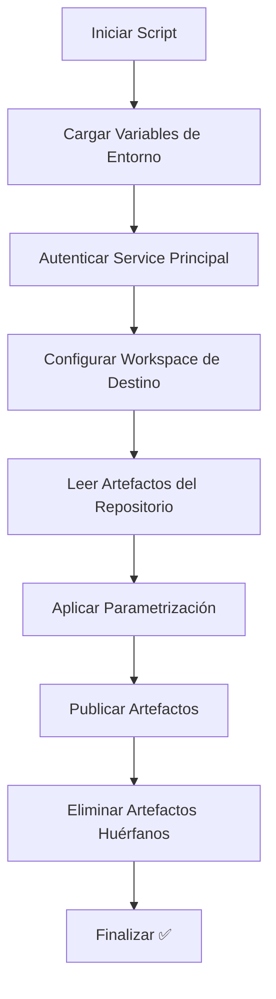

# 🚀 run_fabric_cicd.py - Despliegue Principal de Artefactos

## 📋 Propósito

Este script es el **núcleo del proceso de CI/CD** para Microsoft Fabric. Se encarga de publicar todos los artefactos del repositorio al workspace de destino y mantener la sincronización eliminando elementos huérfanos.

## 🏗️ Arquitectura del Script

### 1. **Autenticación con Service Principal**

```python
from azure.identity import ClientSecretCredential

token_credential = ClientSecretCredential(
    client_id=client_id, 
    client_secret=client_secret, 
    tenant_id=tenant_id
)
```

**¿Qué hace?**: Establece la autenticación usando las credenciales del Service Principal configuradas en GitHub Secrets.

**¿Por qué es importante?**: Permite que el proceso automatizado tenga los permisos necesarios para modificar el workspace de Fabric.

### 2. **Configuración del Workspace de Destino**

```python
target_workspace_lh = FabricWorkspace(
    workspace_id=workspace_id,
    environment=environment,
    repository_directory="./fabric-artifacts",
    item_type_in_scope=["Lakehouse", "Notebook", "Environment", "DataPipeline", "SemanticModel", "Report"],
    token_credential=token_credential,
)
```

**Parámetros clave**:
- `workspace_id`: ID del workspace de Fabric donde se despliegan los artefactos
- `environment`: Nombre del entorno (dev/test/prod) para aplicar parametrización
- `repository_directory`: Carpeta local donde están los artefactos exportados
- `item_type_in_scope`: Tipos de artefactos que serán gestionados

### 3. **Publicación de Artefactos**

```python
publish_all_items(target_workspace_lh)
```

**¿Qué hace?**:
- Lee todos los artefactos de la carpeta `fabric-artifacts/`
- Aplica la parametrización definida en `parameter.yml`
- Crea o actualiza cada artefacto en el workspace de destino
- Mantiene las relaciones y dependencias entre artefactos

**Proceso interno**:
1. **Análisis**: Escanea la estructura de archivos local
2. **Parametrización**: Reemplaza valores según el entorno de destino
3. **Validación**: Verifica que los artefactos sean válidos
4. **Despliegue**: Publica cada elemento al workspace
5. **Verificación**: Confirma que la publicación fue exitosa

### 4. **Limpieza de Artefactos Huérfanos**

```python
unpublish_all_orphan_items(target_workspace_lh)
```

**¿Qué hace?**: Elimina del workspace todos los artefactos que ya no existen en el repositorio.

**¿Por qué es necesario?**: Mantiene el workspace limpio y sincronizado con el estado actual del código.

## 🔄 Flujo de Ejecución



## 📊 Variables de Entorno Utilizadas

| Variable | Propósito | Ejemplo |
|----------|-----------|---------|
| `FABRIC_CLIENT_ID` | ID del Service Principal | `12345678-1234-1234-1234-123456789012` |
| `FABRIC_CLIENT_SECRET` | Secret del Service Principal | `abc123def456...` |
| `FABRIC_TENANT_ID` | ID del tenant de Azure | `87654321-4321-4321-4321-210987654321` |
| `FABRIC_WORKSPACE_ID` | ID del workspace de destino | `11111111-2222-3333-4444-555555555555` |
| `TARGET_ENVIRONMENT_NAME` | Nombre del entorno | `PRO`, `DEV`, `TEST` |

## ⚠️ Consideraciones Importantes

### **Orden de Dependencias**
El script maneja automáticamente las dependencias entre artefactos:
1. **Lakehouses** se despliegan primero (son la base de datos)
2. **Notebooks** y **Pipelines** después (consumen datos)
3. **Semantic Models** utilizan los datos procesados
4. **Reports** se basan en los modelos semánticos

### **Gestión de Errores**
- Si un artefacto falla, el script continúa con los demás
- Los errores se registran para revisión posterior
- Los artefactos dependientes pueden fallar si sus dependencias no se desplegaron correctamente

### **Parametrización**
El archivo `parameter.yml` permite:
- Cambiar IDs de conexiones según el entorno
- Actualizar rutas y nombres de recursos
- Configurar credenciales específicas por entorno

## 🔗 Dependencias Técnicas

- **fabric-cicd**: Librería oficial de Microsoft para CI/CD de Fabric
- **azure-identity**: Para autenticación con Azure AD
- **Permisos requeridos**: El Service Principal debe tener rol de **Admin** o **Member** en el workspace

## 🎯 Casos de Uso

1. **Despliegue Inicial**: Crear un workspace nuevo con todos los artefactos
2. **Actualización**: Sincronizar cambios desde el repositorio
3. **Rollback**: Volver a una versión anterior del código
4. **Promoción entre Entornos**: Mover de dev → test → prod

---

*Este script es ejecutado automáticamente por GitHub Actions en cada push a la rama principal.*